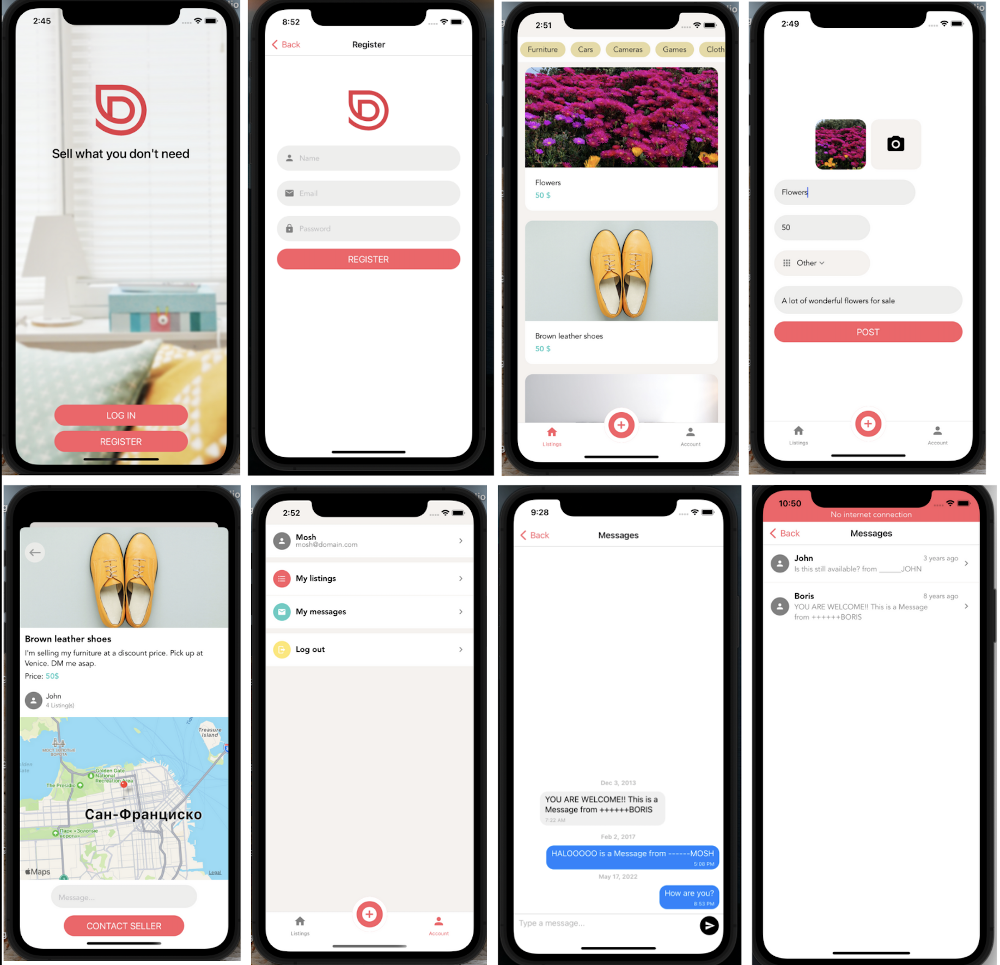

    
        
    
    <h1 align="center"> Done With It </h1>

   <strong>React Native Marketplace Application</strong> built with <strong>Expo CLI</strong> and NodeJS <strong>Express</strong> server.

    
    
    
    

    Done With It offers free user to user classifieds listings.

    At this moment you can use the application only through the 
  <a href="https://github.com/artemgomel89/rNative_back-end">
        local server
   </a>, bacause it's still in development.

## Application features

* `Authorization` - User authentication (Register, Login/out) using `JWT` token.

* `Ability to chat with other users` - Gifted chat.

* `Ability to add listings, connected to your account with geo-positioning` - expo location.

* `11 Screens` - Welcome, Register, Login, Listings, Listing Details Screen, Add new Listing, Upload Listing, Account, Messages, Dialog, My Listings, 

* `Animation` - Using Lottie (Activity Indicator, done animation and more).

* `Cache Layer` - Caching Images.

* `Custom and Reusable Hooks` - Api, Auth, and Notifications.

* `Form Validation` - Using Formik.

* `Splash Screen` - Logo Screen Design while the app is launching.

* `Gesture Handler` - Swipe to delete, and pull to refresh, pull down to go back.

* `Navigation` - Using React Navigation and Stack Navigator.

* `Push Notifications` - Expo Push Notification Services.

* `Reusable Components` - Button, Icon, Forms, Screen, Text, Text Input and more.

Educational project duruing <a href="https://codewithmosh.com/">
        Code with Mosh
    </a> course.

